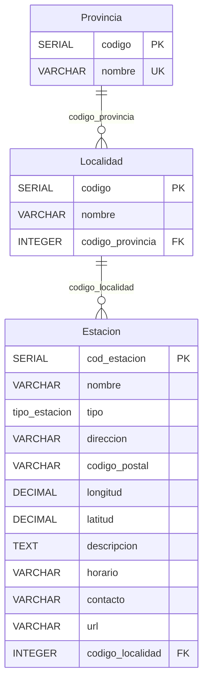
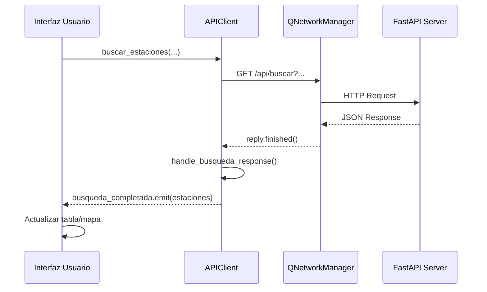
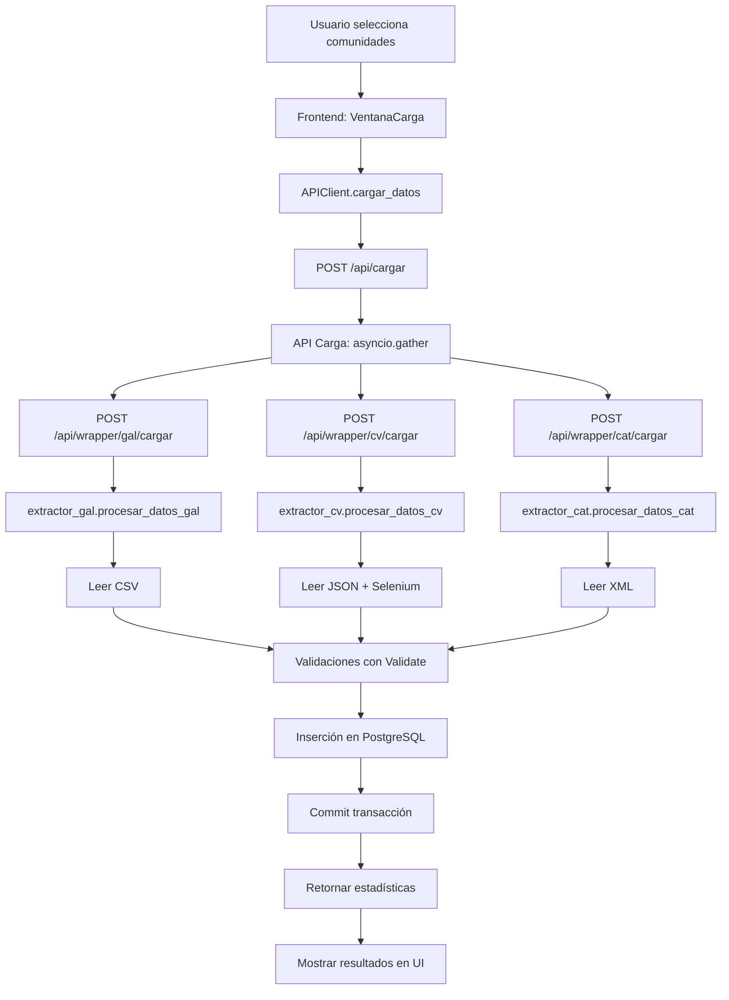
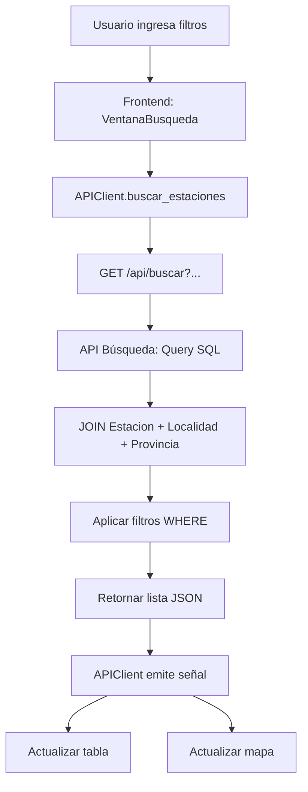

# Documentación del Proyecto IEI-ITV

## Índice
1. [Arquitectura General](#arquitectura-general)
2. [Backend - Base de Datos](#backend---base-de-datos)
3. [Backend - Modelos de Datos](#backend---modelos-de-datos)
4. [Backend - APIs](#backend---apis)
5. [Backend - Wrappers](#backend---wrappers)
6. [Backend - Extractores](#backend---extractores)
7. [Backend - Filtros y Validaciones](#backend---filtros-y-validaciones)
8. [Frontend - Cliente de API](#frontend---cliente-de-api)
9. [Frontend - Interfaz Principal](#frontend---interfaz-principal)

---

## Arquitectura General

El proyecto **IEI-ITV** es una aplicación para gestionar y buscar estaciones de Inspección Técnica de Vehículos (ITV) en España, específicamente en tres comunidades autónomas:
- **Galicia (GAL)**
- **Comunidad Valenciana (CV)**
- **Cataluña (CAT)**

### Estructura del Proyecto

```
IEI-ITV/
├── backend/
│   ├── almacen/          # Gestión de base de datos
│   ├── api/              # Endpoints REST (búsqueda y carga)
│   ├── extractores/      # Procesamiento de datos por comunidad
│   ├── wrappers/         # Interfaces para extractores
│   ├── models.py         # Modelos Pydantic
│   └── server.py         # Servidor FastAPI
├── frontend/
│   ├── ventanas/         # Interfaces de usuario
│   ├── componentes/      # Componentes reutilizables
│   ├── api_client.py     # Cliente HTTP
│   └── main_window.py    # Ventana principal
└── datos_nuevos/         # Archivos fuente (CSV, XML, JSON)
```

### Flujo de Datos

1. **Carga**: Archivos fuente → Extractores → Validación → Base de datos PostgreSQL
2. **Búsqueda**: Frontend → API REST → Base de datos → Frontend

---

## Backend - Base de Datos

**Archivo**: [`backend/almacen/database.py`](file:///c:/Users/Usuario/Proyecto%20IEI/IEI-ITV/backend/almacen/database.py)

### Propósito
Gestiona la conexión a PostgreSQL y la creación del esquema de base de datos.

### Funciones Principales

#### `cargar_configuracion()`
```python
def cargar_configuracion():
```
- **Descripción**: Lee las credenciales de PostgreSQL desde `config.ini`
- **Retorna**: Diccionario con parámetros de conexión (`host`, `database`, `user`, `password`)
- **Excepciones**: 
  - `FileNotFoundError` si no existe `config.ini`
  - `Exception` si falta la sección `[postgresql]`

#### `conectar()`
```python
def conectar():
```
- **Descripción**: Establece conexión con PostgreSQL usando `psycopg2`
- **Retorna**: Objeto `connection` o `None` si hay error
- **Uso**: Llamada en todos los módulos que necesitan acceso a BD

#### `crear_esquema()`
```python
def crear_esquema():
```
- **Descripción**: Crea las tablas y tipos ENUM si no existen
- **Esquema creado**:
  - **ENUM** `tipo_estacion`: `'Estación_fija'`, `'Estación_móvil'`, `'Otros'`
  - **Tabla** `Provincia`: Almacena provincias únicas
  - **Tabla** `Localidad`: Municipios asociados a provincias
  - **Tabla** `Estacion`: Datos completos de estaciones ITV

### Esquema de Base de Datos



---

## Backend - Modelos de Datos

**Archivo**: [`backend/models.py`](file:///c:/Users/Usuario/Proyecto%20IEI/IEI-ITV/backend/models.py)

Define los esquemas de datos usando **Pydantic** para validación automática en FastAPI.

### Modelos de Respuesta

#### `EstacionResponse`
Representa una estación ITV completa con todos sus datos.

| Campo | Tipo | Descripción |
|-------|------|-------------|
| `cod_estacion` | `int` | ID único de la estación |
| `nombre` | `str` | Nombre de la estación |
| `tipo` | `str` | Tipo: Fija, Móvil u Otros |
| `direccion` | `str` | Dirección física |
| `codigo_postal` | `str` | CP (5 dígitos) |
| `longitud` | `float` | Coordenada GPS |
| `latitud` | `float` | Coordenada GPS |
| `horario` | `str` | Horario de atención |
| `contacto` | `str` | Teléfono/email |
| `url` | `str` | Sitio web |
| `localidad` | `str` | Nombre del municipio |
| `provincia` | `str` | Nombre de la provincia |

#### `ProvinciaResponse`
```python
class ProvinciaResponse(BaseModel):
    codigo: int
    nombre: str
```

#### `LocalidadResponse`
```python
class LocalidadResponse(BaseModel):
    codigo: int
    nombre: str
    provincia: str
```

### Modelos de Petición

#### `CargaRequest`
```python
class CargaRequest(BaseModel):
    galicia: bool = False
    valencia: bool = False
    catalunya: bool = False
```
Especifica qué comunidades cargar en la base de datos.

#### `BusquedaRequest`
```python
class BusquedaRequest(BaseModel):
    localidad: Optional[str] = None
    codigo_postal: Optional[str] = None
    provincia: Optional[str] = None
    tipo: Optional[str] = None
```

### Modelos Internos

#### `WrapperResponse`
Respuesta de los wrappers de carga:
- `success`: Indica si la operación fue exitosa
- `insertados`: Número de registros insertados
- `descartados`: Número de registros rechazados
- `log`: Registro detallado del proceso
- `error`: Mensaje de error (opcional)

#### `EstadoAlmacenResponse`
Estado actual de la base de datos:
- `total_estaciones`: Cantidad total de estaciones
- `total_provincias`: Cantidad de provincias
- `total_localidades`: Cantidad de localidades
- `estaciones_por_tipo`: Diccionario con conteo por tipo

---

## Backend - APIs

### API de Búsqueda

**Archivo**: [`backend/api/api_busqueda.py`](file:///c:/Users/Usuario/Proyecto%20IEI/IEI-ITV/backend/api/api_busqueda.py)

#### Endpoint: `GET /api/buscar`

**Propósito**: Buscar estaciones ITV con filtros opcionales.

**Parámetros de Query**:
- `localidad` (opcional): Búsqueda parcial (LIKE) en nombre de localidad
- `codigo_postal` (opcional): Búsqueda exacta de CP
- `provincia` (opcional): Búsqueda parcial en nombre de provincia
- `tipo` (opcional): Tipo exacto de estación

**Respuesta**: Lista de `EstacionResponse`

**Lógica**:
1. Construye query SQL dinámica con JOINs a `Localidad` y `Provincia`
2. Añade cláusulas WHERE según parámetros recibidos
3. Ordena por provincia → localidad → nombre
4. Retorna lista de estaciones con datos completos

**Ejemplo de Query Generada**:
```sql
SELECT 
    e.cod_estacion, e.nombre, e.tipo, e.direccion, e.codigo_postal,
    e.longitud, e.latitud, e.descripcion, e.horario, e.contacto, e.url,
    l.nombre as localidad_nombre, p.nombre as provincia_nombre
FROM Estacion e
JOIN Localidad l ON e.codigo_localidad = l.codigo
JOIN Provincia p ON l.codigo_provincia = p.codigo
WHERE LOWER(l.nombre) LIKE LOWER('%valencia%')
  AND e.codigo_postal = '46001'
ORDER BY p.nombre, l.nombre, e.nombre
```

#### Endpoint: `GET /api/provincias`

**Propósito**: Obtener lista de todas las provincias en la BD.

**Respuesta**: Lista de `ProvinciaResponse` ordenada alfabéticamente.

#### Endpoint: `GET /api/localidades/{provincia}`

**Propósito**: Obtener localidades de una provincia específica.

**Parámetros**:
- `provincia` (path): Nombre de la provincia (case-insensitive)

**Respuesta**: Lista de `LocalidadResponse` ordenada alfabéticamente.

---

### API de Carga

**Archivo**: [`backend/api/api_carga.py`](file:///c:/Users/Usuario/Proyecto%20IEI/IEI-ITV/backend/api/api_carga.py)

#### Endpoint: `POST /api/cargar`

**Propósito**: Cargar datos de estaciones desde archivos fuente.

**Body**: `CargaRequest` (JSON)
```json
{
  "galicia": true,
  "valencia": false,
  "catalunya": true
}
```

**Proceso**:
1. Valida que al menos una comunidad esté seleccionada
2. Crea tareas asíncronas para cada wrapper seleccionado:
   - Valencia → `http://127.0.0.1:8000/api/wrapper/cv/cargar`
   - Galicia → `http://127.0.0.1:8000/api/wrapper/gal/cargar`
   - Catalunya → `http://127.0.0.1:8000/api/wrapper/cat/cargar`
3. Ejecuta todas las tareas en paralelo con `asyncio.gather()`
4. Agrega resultados y retorna resumen

**Respuesta**: `CargaResponse`
```json
{
  "success": true,
  "mensaje": "Valencia: 50 insertados, 5 descartados\nGalicia: 30 insertados, 2 descartados",
  "insertados": 80,
  "descartados": 7,
  "detalles": {
    "valencia": {"insertados": 50, "descartados": 5, "log": "..."},
    "galicia": {"insertados": 30, "descartados": 2, "log": "..."}
  }
}
```

#### Endpoint: `DELETE /api/almacen`

**Propósito**: Borrar todos los datos de la base de datos.

**Proceso**:
1. Ejecuta `DELETE FROM Estacion` (cascada elimina dependencias)
2. Ejecuta `DELETE FROM Localidad`
3. Ejecuta `DELETE FROM Provincia`
4. Hace commit de la transacción

**Respuesta**:
```json
{
  "success": true,
  "mensaje": "Almacén borrado correctamente",
  "detalles": {
    "estaciones_borradas": 150,
    "localidades_borradas": 45,
    "provincias_borradas": 12
  }
}
```

#### Endpoint: `GET /api/estado`

**Propósito**: Obtener estadísticas del almacén.

**Respuesta**: `EstadoAlmacenResponse`
```json
{
  "total_estaciones": 150,
  "total_provincias": 12,
  "total_localidades": 45,
  "estaciones_por_tipo": {
    "Estación_fija": 140,
    "Estación_móvil": 8,
    "Otros": 2
  }
}
```

---

## Backend - Wrappers

Los wrappers son interfaces REST que invocan los extractores correspondientes.

### Estructura Común

Todos los wrappers siguen el mismo patrón:

**Archivos**:
- [`backend/wrappers/wrapper_gal.py`](file:///c:/Users/Usuario/Proyecto%20IEI/IEI-ITV/backend/wrappers/wrapper_gal.py)
- [`backend/wrappers/wrapper_cat.py`](file:///c:/Users/Usuario/Proyecto%20IEI/IEI-ITV/backend/wrappers/wrapper_cat.py)
- [`backend/wrappers/wrapper_cv.py`](file:///c:/Users/Usuario/Proyecto%20IEI/IEI-ITV/backend/wrappers/wrapper_cv.py)

### Endpoint: `POST /api/wrapper/{comunidad}/cargar`

**Ejemplo para Galicia**:
```python
@router.post("/cargar", response_model=WrapperResponse)
def ejecutar_carga_gal():
    from backend.extractores.extractor_gal import procesar_datos_gal
    
    try:
        resultado = procesar_datos_gal()
        
        return {
            'success': True,
            'insertados': resultado.get('insertados', 0),
            'descartados': resultado.get('descartados', 0),
            'log': str(resultado.get('log', '') or '')
        }
    
    except Exception as e:
        return {
            'success': False,
            'error': str(e),
            'insertados': 0,
            'descartados': 0,
            'log': str(e)
        }
```

**Función**:
- Importa dinámicamente el extractor correspondiente
- Ejecuta la función `procesar_datos_*()` del extractor
- Captura excepciones y retorna respuesta estandarizada
- Retorna `WrapperResponse` con estadísticas y logs

**Rutas Registradas en el Servidor**:
- `/api/wrapper/gal/cargar` → Galicia
- `/api/wrapper/cat/cargar` → Catalunya
- `/api/wrapper/cv/cargar` → Comunidad Valenciana

---

## Backend - Extractores

Los extractores procesan archivos fuente y cargan datos en la base de datos.

### Extractor de Galicia

**Archivo**: [`backend/extractores/extractor_gal.py`](file:///c:/Users/Usuario/Proyecto%20IEI/IEI-ITV/backend/extractores/extractor_gal.py)

#### Función: `leer_datos_gal()`
```python
def leer_datos_gal():
```
- **Propósito**: Lee el archivo CSV de estaciones de Galicia
- **Ruta**: `backend/datos_nuevos/Estacions_ITV.csv`
- **Retorna**: Contenido del CSV como string o `None` si hay error

#### Función: `procesar_datos_gal()`
```python
def procesar_datos_gal():
```
**Proceso completo**:

1. **Lectura**: Carga el CSV usando `csv.DictReader` con delimitador `;`

2. **Inicialización**:
   - Conecta a la base de datos
   - Crea instancia de `Validate` para filtros
   - Inicializa contadores de estadísticas

3. **Procesamiento por fila**:
   ```python
   for i, item in enumerate(lista_estaciones):
       nombre_estacion = limpiar_texto(item.get('NOME DA ESTACIÓN'))
       nombre_prov = limpiar_texto(item.get('PROVINCIA'))
       nombre_loc = limpiar_texto(item.get('CONCELLO'))
       direccion = limpiar_texto(item.get('ENDEREZO'))
       cp_raw = item.get('CÓDIGO POSTAL')
       horario = limpiar_texto(item.get('HORARIO'))
       tel = limpiar_texto(item.get('TELÉFONO'))
       email = limpiar_texto(item.get('CORREO ELECTRÓNICO'))
       coordenadas_str = item.get('COORDENADAS GMAPS')
   ```

4. **Validaciones** (en orden):
   - ❌ Descarta si falta provincia o localidad
   - ❌ Descarta si nombre duplicado (`filtro.es_duplicado()`)
   - ❌ Descarta si provincia no válida (`filtro.es_provincia_real()`)
   - ❌ Descarta si estación fija sin CP válido
   - ⚠️ Modifica CP a vacío si es estación móvil/otros
   - ❌ Descarta si coordenadas inválidas

5. **Inserción**:
   - Obtiene/crea provincia con `get_or_create_provincia()`
   - Obtiene/crea localidad con `get_or_create_localidad()`
   - Inserta estación en la tabla `Estacion`

6. **Finalización**:
   - Hace commit de la transacción
   - Imprime resumen detallado
   - Retorna diccionario con estadísticas y logs

#### Función: `convertir_coordenadas(coord_str)`
```python
def convertir_coordenadas(coord_str):
```
**Propósito**: Convierte coordenadas en formato DMS (grados, minutos) a decimal.

**Formatos soportados**:
- Decimal directo: `"42.345678"` → `42.345678`
- Grados y minutos: `"42° 20.74"` → `42.345667`

**Algoritmo**:
```python
patron = re.compile(r"(-?\d+)[°º\s]+(\d+\.?\d*)")
grados = float(match.group(1))
minutos = float(match.group(2))

if grados < 0:
    decimal = grados - (minutos / 60)
else:
    decimal = grados + (minutos / 60)
```

#### Función: `limpiar_texto(texto)`
Elimina espacios en blanco al inicio y final de strings.

#### Funciones de Base de Datos

**`get_or_create_provincia(cursor, nombre_provincia)`**:
- Busca provincia por nombre
- Si existe, retorna su código
- Si no existe, la crea y retorna el nuevo código

**`get_or_create_localidad(cursor, nombre_localidad, provincia_id)`**:
- Busca localidad por nombre y provincia
- Si existe, retorna su código
- Si no existe, la crea y retorna el nuevo código

---

### Extractor de Cataluña

**Archivo**: [`backend/extractores/extractor_cat.py`](file:///c:/Users/Usuario/Proyecto%20IEI/IEI-ITV/backend/extractores/extractor_cat.py)

#### Función: `leer_datos_cat()`
- **Ruta**: `backend/datos_nuevos/ITV-CAT.xml`
- **Retorna**: Contenido XML como string

#### Función: `procesar_datos_cat()`

**Diferencias con Galicia**:

1. **Parseo XML**:
   ```python
   xml_root = ET.fromstring(datos_xml_cat)
   lista_estaciones = xml_root.findall(".//row/row")
   ```

2. **Extracción de datos**:
   ```python
   nombre_estacion = get_texto_from_tag(item, 'denominaci')
   nombre_prov = get_texto_from_tag(item, 'serveis_territorials')
   nombre_loc = get_texto_from_tag(item, 'municipi')
   direccion = get_texto_from_tag(item, 'adre_a')
   cp_raw = get_texto_from_tag(item, 'cp')
   horario = get_texto_from_tag(item, 'horari_de_servei')
   contacto = get_texto_from_tag(item, 'correu_electr_nic')
   ```

3. **Coordenadas**:
   ```python
   lat_raw = get_texto_from_tag(item, 'lat')
   latitud = convertir_coordenadas(lat_raw)
   
   long_raw = get_texto_from_tag(item, 'long')
   longitud = convertir_coordenadas(long_raw)
   ```
   - Las coordenadas vienen en formato entero (microgrados)
   - Se dividen por 1,000,000 para obtener decimales

4. **URL**:
   ```python
   tag_web = item.find('web')
   url = tag_web.get('url')  # Atributo, no texto
   ```

#### Función: `get_texto_from_tag(elemento_xml, nombre_tag)`
```python
def get_texto_from_tag(elemento_xml, nombre_tag):
    tag = elemento_xml.find(nombre_tag)
    if tag is not None and tag.text is not None:
        return limpiar_texto(tag.text)
    return None
```
Extrae y limpia texto de un tag XML.

#### Función: `convertir_coordenadas(coordenadas_str)`
```python
def convertir_coordenadas(coordenadas_str):
    try:
        return float(coordenadas_str) / 1000000.0
    except (ValueError, TypeError):
        return None
```
Convierte microgrados a grados decimales.

---

### Extractor de Comunidad Valenciana

**Archivo**: [`backend/extractores/extractor_cv.py`](file:///c:/Users/Usuario/Proyecto%20IEI/IEI-ITV/backend/extractores/extractor_cv.py)

#### Función: `leer_datos_cv()`
- **Ruta**: `backend/datos_nuevos/estaciones.json`
- **Retorna**: Lista de diccionarios parseada con `json.load()`

#### Función: `procesar_datos_cv()`

**Características únicas**:

1. **Uso de Selenium**:
   - Las coordenadas NO vienen en el archivo fuente
   - Se obtienen dinámicamente mediante web scraping

2. **Inicialización de Selenium**:
   ```python
   def iniciar_driver():
       chrome_options = Options()
       chrome_options.add_argument("--no-sandbox")
       chrome_options.add_argument("--disable-dev-shm-usage")
       chrome_options.add_argument("--log-level=3")
       driver = webdriver.Chrome(options=chrome_options)
       return driver
   ```

3. **Obtención de coordenadas**:
   ```python
   def obtener_coordenadas(driver, direccion, municipio, provincia):
       busqueda = f"{direccion}, {municipio}, {provincia}, España"
       url = "https://www.coordenadas-gps.com"
       
       # Navegar y aceptar cookies
       driver.get(url)
       boton_cookies = WebDriverWait(driver, 3).until(...)
       boton_cookies.click()
       
       # Buscar dirección
       input_address = WebDriverWait(driver, 10).until(
           EC.presence_of_element_located((By.ID, "address"))
       )
       input_address.clear()
       input_address.send_keys(busqueda)
       
       boton_buscar = driver.find_element(...)
       boton_buscar.click()
       
       time.sleep(5)  # Esperar resultados
       
       # Extraer coordenadas
       lat_input = driver.find_element(By.ID, "latitude")
       lon_input = driver.find_element(By.ID, "longitude")
       
       lat_texto = lat_input.get_attribute("value")
       lon_texto = lon_input.get_attribute("value")
       
       return float(lat_texto), float(lon_texto)
   ```

4. **Extracción de datos JSON**:
   ```python
   nombre_estacion = str(item.get('Nº ESTACIÓN', ''))
   nombre_prov = limpiar_texto(item.get('PROVINCIA'))
   nombre_loc = limpiar_texto(item.get('MUNICIPIO'))
   tipo_estacion = normalizar_tipo_estacion(item.get('TIPO ESTACIÓN'))
   direccion = limpiar_texto(item.get('DIRECCIÓN'))
   cp_raw = item.get('C.POSTAL')
   horario = limpiar_texto(item.get('HORARIOS'))
   contacto = limpiar_texto(item.get('CORREO'))
   ```

5. **Normalización de tipo**:
   ```python
   def normalizar_tipo_estacion(tipo_origen):
       if not tipo_origen: return "Otros"
       tipo = str(tipo_origen).lower()
       if "fija" in tipo: return "Estación_fija"
       elif "móvil" in tipo or "movil" in tipo: return "Estación_móvil"
       else: return "Otros"
   ```

6. **Limpieza final**:
   ```python
   finally:
       if driver: 
           driver.quit()  # Cerrar navegador
       if cur: 
           cur.close()
       if conn: 
           conn.close()
   ```

---

## Backend - Filtros y Validaciones

**Archivo**: [`backend/extractores/filtros.py`](file:///c:/Users/Usuario/Proyecto%20IEI/IEI-ITV/backend/extractores/filtros.py)

### Clase: `Validate`

Centraliza todas las validaciones de datos para los extractores.

#### Atributos de Clase

**`MAPA_PROVINCIAS`**: Diccionario de normalización de nombres de provincias.

```python
MAPA_PROVINCIAS = {
    # Comunidad Valenciana
    'valencia': 'Valencia',
    'valència': 'Valencia',
    'alicante': 'Alicante',
    'alacant': 'Alicante',
    'castellon': 'Castellón',
    'castello': 'Castellón',
    
    # Galicia
    'a coruna': 'A Coruña',
    'la coruna': 'A Coruña',
    'coruna': 'A Coruña',
    'lugo': 'Lugo',
    'ourense': 'Ourense',
    'orense': 'Ourense',
    'pontevedra': 'Pontevedra',
    
    # Cataluña
    'barcelona': 'Barcelona',
    'girona': 'Girona',
    'gerona': 'Girona',
    'lleida': 'Lleida',
    'lerida': 'Lleida',
    'tarragona': 'Tarragona',
}
```

**`PREFIJOS_CP`**: Prefijos válidos de códigos postales por comunidad.

```python
PREFIJOS_CP = {
    'GAL': {'15', '27', '32', '36'},       # Coruña, Lugo, Ourense, Pontevedra
    'CV':  {'03', '12', '46'},             # Alicante, Castellón, Valencia
    'CAT': {'08', '17', '25', '43'}        # Barcelona, Girona, Lleida, Tarragona
}
```

#### Constructor

```python
def __init__(self, cursor):
    self.cursor = cursor
```
Recibe un cursor de base de datos para realizar consultas.

#### Métodos

##### `_normalizar_para_clave(texto)`
```python
def _normalizar_para_clave(self, texto):
    if not texto:
        return ""
    texto = str(texto).lower().strip()
    texto_norm = unicodedata.normalize('NFD', texto)
    return ''.join(c for c in texto_norm if unicodedata.category(c) != 'Mn')
```
**Propósito**: Normaliza texto para comparaciones.
- Convierte a minúsculas
- Elimina acentos (descompone y quita marcas diacríticas)
- Ejemplo: `"València"` → `"valencia"`

##### `estandarizar_nombre_provincia(nombre_sucio)`
```python
def estandarizar_nombre_provincia(self, nombre_sucio):
    if not nombre_sucio:
        return None
        
    clave = self._normalizar_para_clave(nombre_sucio)
    
    if clave in self.MAPA_PROVINCIAS:
        return self.MAPA_PROVINCIAS[clave]
        
    return nombre_sucio.title()
```
**Propósito**: Convierte variantes de nombres a forma canónica.
- `"VALENCIA"` → `"Valencia"`
- `"alacant"` → `"Alicante"`
- `"La Coruña"` → `"A Coruña"`

##### `es_duplicado(nombre_estacion)`
```python
def es_duplicado(self, nombre_estacion):
    try:
        query = "SELECT cod_estacion FROM Estacion WHERE nombre = %s LIMIT 1"
        self.cursor.execute(query, (nombre_estacion,))
        return self.cursor.fetchone() is not None
    except Exception as e:
        print(f"Error verificando duplicado: {e}")
        return False
```
**Propósito**: Verifica si ya existe una estación con ese nombre.
- Retorna `True` si existe
- Previene duplicados en la base de datos

##### `validar_y_formatear_cp(cp_raw, comunidad_destino=None)`
```python
def validar_y_formatear_cp(self, cp_raw, comunidad_destino=None):
    if not cp_raw:
        return ""
    
    cp_str = str(cp_raw).strip()
    
    # Normalizar a 5 dígitos
    cp_limpio = None
    if len(cp_str) == 4 and cp_str.isdigit():
        cp_limpio = "0" + cp_str
    elif len(cp_str) == 5 and cp_str.isdigit():
        cp_limpio = cp_str
    
    if not cp_limpio:
        return ""

    # Validar prefijo por comunidad
    if comunidad_destino:
        prefijos_validos = self.PREFIJOS_CP.get(comunidad_destino)
        prefijo_actual = cp_limpio[:2] 
        
        if prefijos_validos and prefijo_actual not in prefijos_validos:
            return ""  # CP no pertenece a la comunidad

    return cp_limpio
```
**Propósito**: Valida y normaliza códigos postales.
- Convierte 4 dígitos a 5 (añade `0` al inicio)
- Valida que el prefijo corresponda a la comunidad
- Ejemplo: `"3001"` + `comunidad='CV'` → `"03001"` ✅
- Ejemplo: `"28001"` + `comunidad='CV'` → `""` ❌ (Madrid, no Valencia)

##### `tiene_coordenadas_validas(latitud, longitud)`
```python
def tiene_coordenadas_validas(self, latitud, longitud):
    if latitud is None or longitud is None:
        return False
        
    try:
        lat = float(latitud)
        lon = float(longitud)
        
        LAT_MIN, LAT_MAX = 36.0, 44.0
        LON_MIN, LON_MAX = -10.0, 3.5
        
        en_rango_lat = LAT_MIN <= lat <= LAT_MAX
        en_rango_lon = LON_MIN <= lon <= LON_MAX
        
        if not (en_rango_lat and en_rango_lon):
            return False
            
        return True
        
    except (ValueError, TypeError):
        return False
```
**Propósito**: Valida que las coordenadas estén dentro de España.
- Latitud: 36.0° a 44.0° (sur de Andalucía a Pirineos)
- Longitud: -10.0° a 3.5° (oeste de Galicia a este de Cataluña)

##### `es_provincia_real(nombre_provincia)`
```python
def es_provincia_real(self, nombre_provincia):
    if not nombre_provincia: return False
    clave = self._normalizar_para_clave(nombre_provincia)
    return clave in self.MAPA_PROVINCIAS
```
**Propósito**: Verifica que la provincia esté en el mapa de provincias soportadas.

---

## Frontend - Cliente de API

**Archivo**: [`frontend/api_client.py`](file:///c:/Users/Usuario/Proyecto%20IEI/IEI-ITV/frontend/api_client.py)

### Clase: `APIClient`

Cliente HTTP asíncrono basado en **Qt Network** para comunicarse con la API FastAPI.

#### Herencia y Señales

```python
class APIClient(QObject):
    # Señales para manejar respuestas asíncronas
    busqueda_completada = Signal(list)
    carga_completada = Signal(dict)
    error_ocurrido = Signal(str)
    provincias_recibidas = Signal(list)
    estado_recibido = Signal(dict)
```

**Señales Qt**: Permiten comunicación asíncrona entre el cliente y la interfaz.

#### Constructor

```python
def __init__(self, base_url="http://127.0.0.1:8000"):
    super().__init__()
    self.base_url = base_url
    self.manager = QNetworkAccessManager()
```

#### Métodos Principales

##### `buscar_estaciones(localidad, codigo_postal, provincia, tipo)`

**Propósito**: Realiza búsqueda de estaciones.

**Proceso**:
1. Construye URL con parámetros de query:
   ```python
   params = []
   if localidad:
       params.append(f"localidad={localidad}")
   if codigo_postal:
       params.append(f"codigo_postal={codigo_postal}")
   # ...
   url = f"{self.base_url}/api/buscar?{'&'.join(params)}"
   ```

2. Crea petición GET:
   ```python
   request = QNetworkRequest(QUrl(url))
   reply = self.manager.get(request)
   ```

3. Conecta manejador de respuesta:
   ```python
   reply.finished.connect(lambda: self._handle_busqueda_response(reply))
   ```

##### `_handle_busqueda_response(reply)`

**Propósito**: Procesa respuesta de búsqueda.

```python
def _handle_busqueda_response(self, reply: QNetworkReply):
    if reply.error() == QNetworkReply.NetworkError.NoError:
        data = reply.readAll().data()
        try:
            estaciones = json.loads(data.decode('utf-8'))
            self.busqueda_completada.emit(estaciones)  # Emite señal
        except json.JSONDecodeError as e:
            self.error_ocurrido.emit(f"Error al parsear respuesta: {str(e)}")
    else:
        self.error_ocurrido.emit(f"Error en la búsqueda: {reply.errorString()}")
    
    reply.deleteLater()  # Libera memoria
```

##### `obtener_provincias()`

**Propósito**: Obtiene lista de provincias para poblar dropdown.

```python
def obtener_provincias(self):
    url = f"{self.base_url}/api/provincias"
    request = QNetworkRequest(QUrl(url))
    reply = self.manager.get(request)
    reply.finished.connect(lambda: self._handle_provincias_response(reply))
```

##### `cargar_datos(galicia, valencia, catalunya)`

**Propósito**: Ejecuta carga de datos.

```python
def cargar_datos(self, galicia=False, valencia=False, catalunya=False):
    url = f"{self.base_url}/api/cargar"
    request = QNetworkRequest(QUrl(url))
    request.setHeader(QNetworkRequest.KnownHeaders.ContentTypeHeader, "application/json")
    
    payload = {
        "galicia": galicia,
        "valencia": valencia,
        "catalunya": catalunya
    }
    
    reply = self.manager.post(request, json.dumps(payload).encode('utf-8'))
    reply.finished.connect(lambda: self._handle_carga_response(reply))
```

##### `borrar_almacen()`

**Propósito**: Borra todos los datos.

```python
def borrar_almacen(self):
    url = f"{self.base_url}/api/almacen"
    request = QNetworkRequest(QUrl(url))
    reply = self.manager.deleteResource(request)  # DELETE request
    reply.finished.connect(lambda: self._handle_borrar_response(reply))
```

##### `obtener_estado()`

**Propósito**: Obtiene estadísticas del almacén.

```python
def obtener_estado(self):
    url = f"{self.base_url}/api/estado"
    request = QNetworkRequest(QUrl(url))
    reply = self.manager.get(request)
    reply.finished.connect(lambda: self._handle_estado_response(reply))
```

### Flujo de Comunicación



---

## Frontend - Interfaz Principal

**Archivo**: [`frontend/main_window.py`](file:///c:/Users/Usuario/Proyecto%20IEI/IEI-ITV/frontend/main_window.py)

### Clase: `MainWindow`

Ventana principal de la aplicación con sistema de pestañas.

#### Constructor

```python
class MainWindow(QMainWindow):
    def __init__(self):
        super().__init__()
        self.setWindowTitle("IEI - ITV")
        self.resize(1000, 700)
```

#### Estilo Visual

Aplica tema oscuro con gradientes:

```python
self.setStyleSheet("""
    QMainWindow {
        background: qlineargradient(x1:0, y1:0, x2:1, y2:1,
            stop:0 #1a1a2e, stop:0.5 #16213e, stop:1 #0f3460);
    }
""")
```

#### Sistema de Pestañas

```python
self.tabs = QTabWidget()
self.tabs.setStyleSheet("""
    QTabWidget::pane {
        border: 2px solid #457b9d;
        border-radius: 8px;
        background-color: transparent;
    }
    QTabBar::tab {
        background: qlineargradient(...);
        color: #a8dadc;
        border: 2px solid #457b9d;
        padding: 10px 20px;
        font-size: 14px;
        font-weight: bold;
    }
    QTabBar::tab:selected {
        background: qlineargradient(...);
        color: #ffffff;
        border-color: #06a77d;
    }
    QTabBar::tab:hover:!selected {
        background: qlineargradient(...);
        color: #48cae4;
    }
""")
```

#### Ventanas Integradas

```python
self.ventana_busqueda = VentanaBusqueda()
self.ventana_carga = VentanaCarga()

self.tabs.addTab(self.ventana_busqueda, "Buscador")
self.tabs.addTab(self.ventana_carga, "Carga")
```

**Pestaña "Buscador"**:
- Formulario de búsqueda con filtros
- Tabla de resultados
- Mapa interactivo con marcadores

**Pestaña "Carga"**:
- Checkboxes para seleccionar comunidades
- Botón de carga de datos
- Botón de borrado de almacén
- Visualización de estado y logs

---

## Resumen de Flujo Completo

### Flujo de Carga de Datos



### Flujo de Búsqueda



---

## Tecnologías Utilizadas

| Componente | Tecnología | Propósito |
|------------|-----------|-----------|
| **Backend API** | FastAPI | Framework REST asíncrono |
| **Base de Datos** | PostgreSQL | Almacenamiento relacional |
| **ORM/Driver** | psycopg2 | Conector Python-PostgreSQL |
| **Validación** | Pydantic | Modelos de datos tipados |
| **Web Scraping** | Selenium | Obtención de coordenadas (CV) |
| **Parseo CSV** | csv (stdlib) | Lectura de datos GAL |
| **Parseo XML** | xml.etree.ElementTree | Lectura de datos CAT |
| **Parseo JSON** | json (stdlib) | Lectura de datos CV |
| **Frontend UI** | PySide6 (Qt) | Interfaz gráfica |
| **HTTP Client** | QNetworkAccessManager | Peticiones asíncronas |
| **Servidor ASGI** | Uvicorn | Servidor de producción |

---

## Configuración y Ejecución

### Archivo de Configuración

**`config.ini`**:
```ini
[postgresql]
host = localhost
database = itv_db
user = postgres
password = tu_password
```

### Inicialización

```bash
# Crear esquema de base de datos
python init_project.py

# Iniciar servidor FastAPI
python run_server.py
# O directamente:
python backend/server.py
```

### Ejecución del Frontend

```bash
python main.py
```

---

## Endpoints de la API

| Método | Endpoint | Descripción |
|--------|----------|-------------|
| `GET` | `/` | Información de la API |
| `GET` | `/health` | Estado del servidor |
| `GET` | `/api/buscar` | Buscar estaciones |
| `GET` | `/api/provincias` | Listar provincias |
| `GET` | `/api/localidades/{provincia}` | Localidades de una provincia |
| `POST` | `/api/cargar` | Cargar datos de comunidades |
| `DELETE` | `/api/almacen` | Borrar todos los datos |
| `GET` | `/api/estado` | Estadísticas del almacén |
| `POST` | `/api/wrapper/gal/cargar` | Cargar solo Galicia |
| `POST` | `/api/wrapper/cv/cargar` | Cargar solo Valencia |
| `POST` | `/api/wrapper/cat/cargar` | Cargar solo Cataluña |

---

## Manejo de Errores

### En Extractores

Todos los extractores siguen el patrón:

```python
try:
    # Procesamiento de datos
    conn.commit()
    return {
        'insertados': contadores['insertados'],
        'descartados': contadores['descartados'],
        'log': output_buffer.getvalue()
    }
except Exception as e:
    print(f"Error en el proceso: {e}")
    if conn:
        conn.rollback()  # Revertir cambios
    return {
        'insertados': 0,
        'descartados': 0,
        'log': output_buffer.getvalue()
    }
finally:
    if cur:
        cur.close()
    if conn:
        conn.close()
```

### En APIs

```python
try:
    # Lógica de negocio
    return resultado
except Exception as e:
    raise HTTPException(status_code=500, detail=f"Error: {str(e)}")
finally:
    # Limpieza de recursos
    if cur:
        cur.close()
    if conn:
        conn.close()
```

### En Frontend

```python
def _handle_response(self, reply: QNetworkReply):
    if reply.error() == QNetworkReply.NetworkError.NoError:
        # Procesar respuesta exitosa
        self.signal_completada.emit(data)
    else:
        # Emitir error
        self.error_ocurrido.emit(f"Error: {reply.errorString()}")
    
    reply.deleteLater()
```

---

## Conclusión

Este proyecto implementa una arquitectura **cliente-servidor** completa para gestionar estaciones ITV:

- **Backend**: API REST con FastAPI, validaciones robustas y procesamiento de múltiples formatos de datos
- **Base de Datos**: Esquema relacional normalizado en PostgreSQL
- **Frontend**: Interfaz gráfica moderna con Qt, comunicación asíncrona y visualización de datos

La modularidad del diseño permite:
- ✅ Añadir nuevas comunidades autónomas fácilmente
- ✅ Escalar el sistema horizontalmente
- ✅ Mantener y depurar componentes de forma independiente
- ✅ Reutilizar validaciones y lógica de negocio
